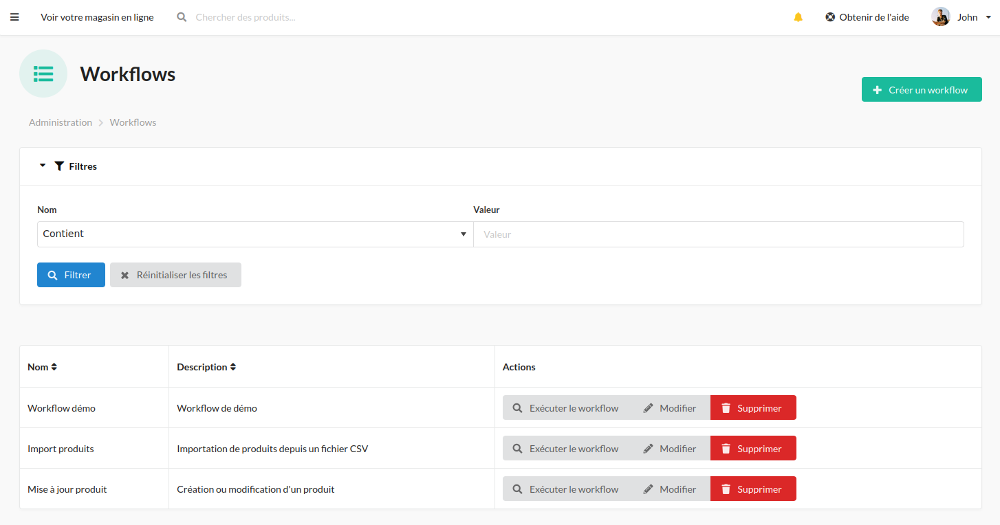
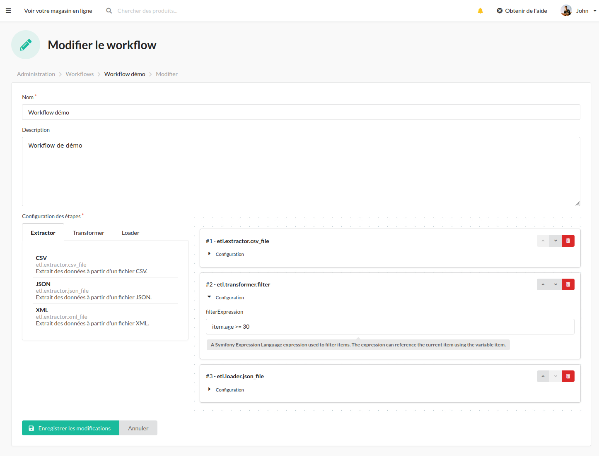
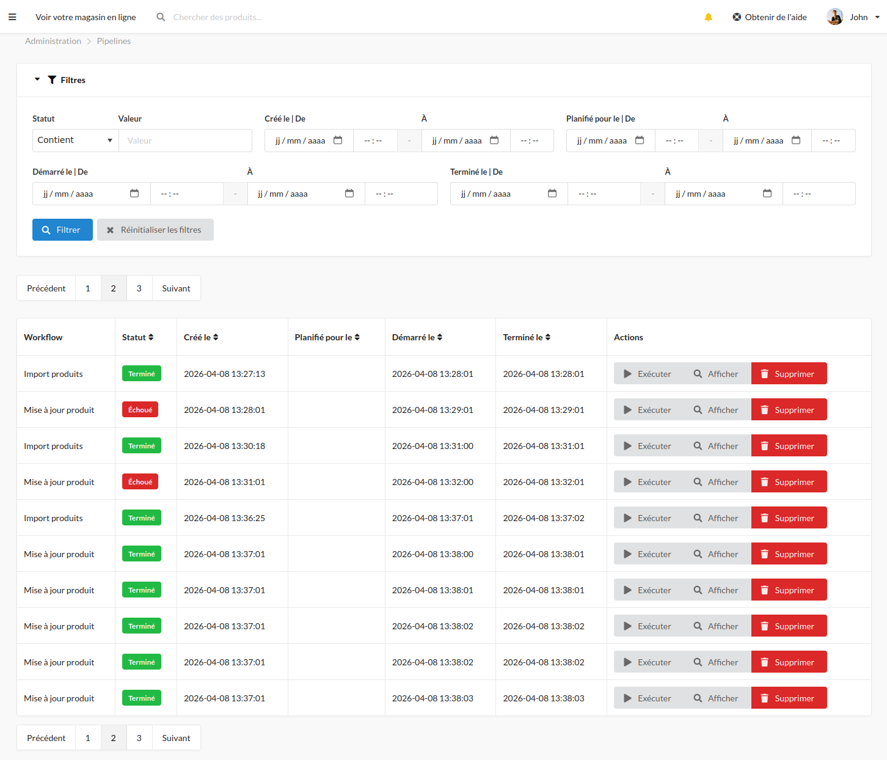
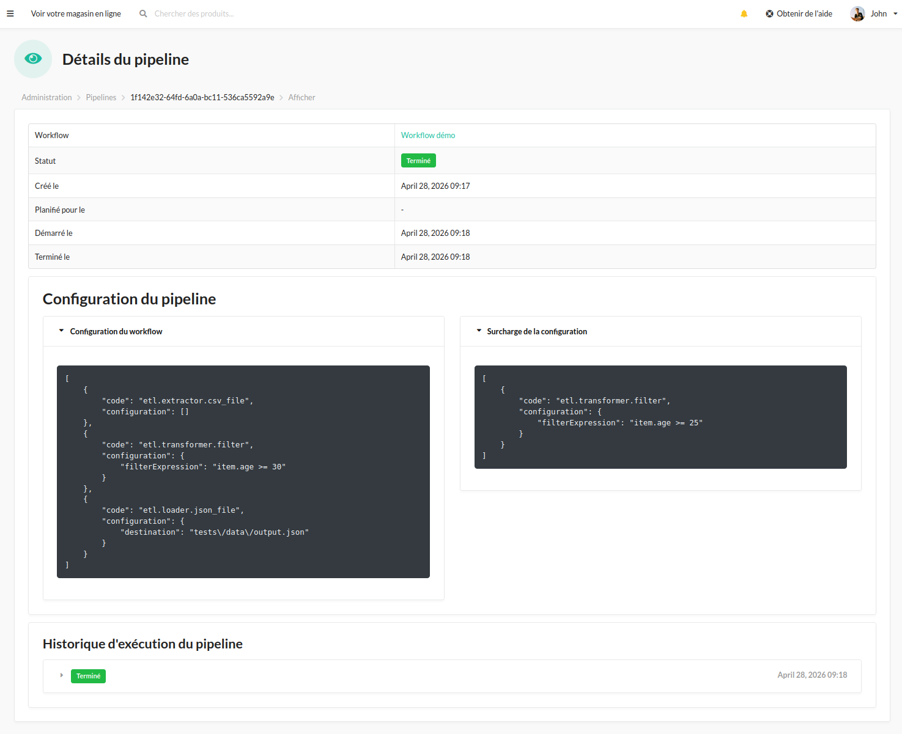
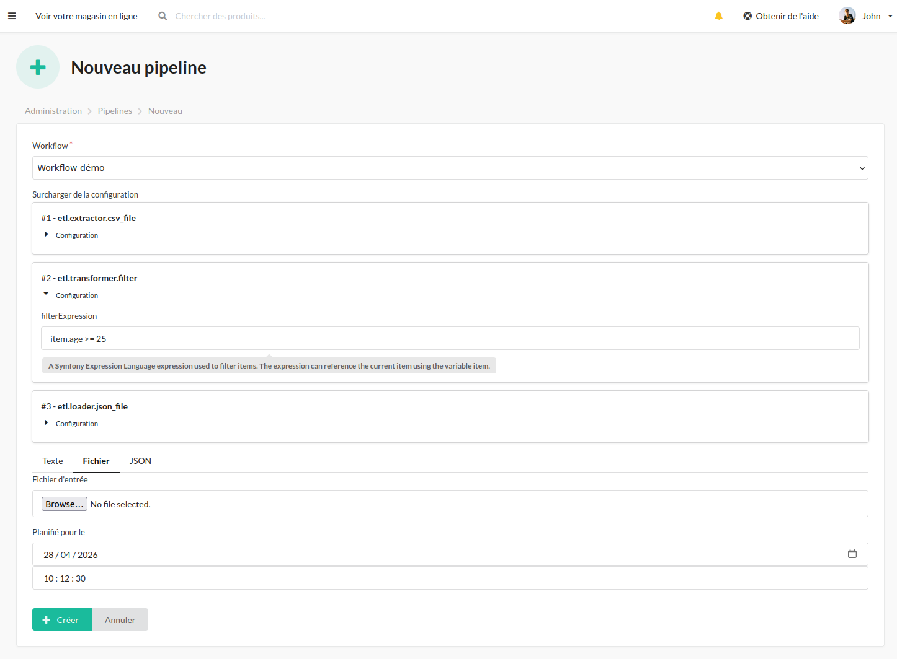
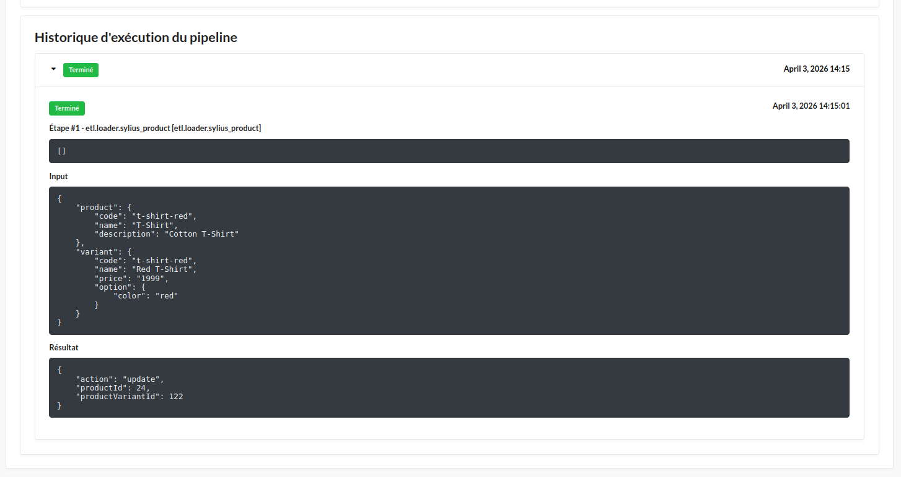

<p align="center">
    <a href="https://sylius.com" target="_blank">
        <picture>
          <source media="(prefers-color-scheme: dark)" srcset="https://media.sylius.com/sylius-logo-800-dark.png">
          <source media="(prefers-color-scheme: light)" srcset="https://media.sylius.com/sylius-logo-800.png">
          
        </picture>
    </a>
</p>

<h1 align="center">BoutDeCode Sylius ETL Plugin</h1>

<p align="center">Integrate a full ETL (Extract, Transform, Load) pipeline system into the Sylius admin panel.</p>

<p align="center">
    <a href="https://packagist.org/packages/boutdecode/sylius-etlplugin" title="License">
        
    </a>
    <a href="https://packagist.org/packages/boutdecode/sylius-etlplugin" title="PHP Version">
        
    </a>
</p>

## Overview

This plugin adds a full-featured ETL workflow management system to the Sylius admin panel. It allows store administrators to define reusable **Workflows** (named chains of ordered ETL Steps), and execute them as **Pipelines** — either manually, via file upload, or on a schedule.

The plugin provides the ETL infrastructure (workflow management, pipeline execution, history tracking). Step implementations are defined in your application.

## Features

- **Workflow management** — create and configure reusable chains of ETL steps from the admin panel
- **Pipeline execution** — run workflows as pipelines with JSON input, file upload, or scheduled execution
- **Execution history** — detailed per-step and per-pipeline run history with status tracking
- **Step registry** — register your own step services tagged with `etl.step`
- **State machine** — pipeline lifecycle management with reset/execute transitions
- **Planned tasks** — define recurring ETL jobs by binding a workflow to a cron expression; a new pipeline is created and dispatched automatically on each occurrence
- **Dedicated logging** — separate `pipeline` log channel for ETL activity
- **Notifications** — notify on pipeline success and/or failure per workflow, through pluggable providers (built-in email support)
- **Sylius admin integration** — ETL section added to the admin sidebar with grid views for Workflows and Pipelines

### Screenshots

**Workflow list**



**Workflow editor** — configure ordered steps with their configuration



**Pipeline list**



**Pipeline detail** — inspect pipeline and configuration



**Execute a pipeline** — provide a file upload, JSON input or a scheduled date; the workflow configuration can also be overridden at runtime per step



**Pipeline run history** — per-step status and execution timeline



## Requirements

- PHP `^8.1`
- Sylius `^1.14`
- Symfony `^6.4`
- Symfony Messenger with an `async` transport

## Installation

### 1. Require the plugin via Composer

```bash
composer require boutdecode/sylius-etl-plugin
```

### 2. Enable the plugin

Add the plugin to your `config/bundles.php`:

```php
return [
    // ...
    BoutDeCode\SyliusETLPlugin\BoutDeCodeSyliusETLPlugin::class => ['all' => true],
];
```

### 3. Import the plugin configuration

**PHP** — create or update `config/packages/bout_de_code_sylius_etl.php`:

```php
<?php

declare(strict_types=1);

use Symfony\Component\DependencyInjection\Loader\Configurator\ContainerConfigurator;

return static function (ContainerConfigurator $containerConfigurator): void {
    $containerConfigurator->import('@BoutDeCodeETLCoreBundle/Resources/config/config.yaml');
    $containerConfigurator->import('@BoutDeCodeSyliusETLPlugin/config/config.php');
};
```

**YAML** — create or update `config/packages/bout_de_code_sylius_etl.yaml`:

```yaml
imports:
    - { resource: '@BoutDeCodeETLCoreBundle/Resources/config/config.yaml' }
    - { resource: '@BoutDeCodeSyliusETLPlugin/config/config.php' }
```

### 4. Import the admin routes

**PHP** — add to `config/routes.php` (or `config/routes/sylius_admin.php`):

```php
<?php

declare(strict_types=1);

use Symfony\Component\Routing\Loader\Configurator\RoutingConfigurator;

return static function (RoutingConfigurator $routingConfigurator): void {
    $routingConfigurator->import('@BoutDeCodeSyliusETLPlugin/config/routes/admin.php');
};
```

**YAML** — add to `config/routes.yaml` (or `config/routes/sylius_admin.yaml`):

```yaml
bout_de_code_sylius_etl_admin:
    resource: '@BoutDeCodeSyliusETLPlugin/config/routes/admin.php'
```

### 5. Configure Symfony Messenger

Ensure an `async` transport is configured in `config/packages/messenger.yaml`:

```yaml
framework:
    messenger:
        transports:
            async: '%env(MESSENGER_TRANSPORT_DSN)%'
```

### 6. Import the admin assets

Add a dedicated entry in your `webpack.config.js`:

```js
const path = require('path');

Encore
    // ...
    .addEntry(
        'boutdecode-etl-plugin-admin-entry',
        path.resolve(
            __dirname,
            'vendor/boutdecode/sylius-etl-plugin/assets/admin/entrypoint.js'
        )
    )
```

Then include the compiled entry in your admin layout (e.g. `templates/bundles/SyliusAdminBundle/layout.html.twig`):

```twig
{{ encore_entry_script_tags('boutdecode-etl-plugin-admin-entry') }}
{{ encore_entry_link_tags('boutdecode-etl-plugin-admin-entry') }}
```

Then install and build the assets:

```bash
bin/console assets:install
yarn encore dev
```

### 7. Run database migrations

```bash
bin/console doctrine:migrations:migrate
```

### 8. Start the Messenger worker

Pipeline execution and planned task scheduling are processed asynchronously via Symfony Messenger. Start the worker with both the `async` and `scheduler_etl` transports:

```bash
bin/console messenger:consume async scheduler_etl
```

In production, use a process manager (Supervisor, `systemd`, etc.) to keep the worker running continuously.

## Usage

### Workflows

Navigate to **Admin > ETL > Workflows** to create a new Workflow. A workflow defines an ordered chain of steps, each with a step type code and a JSON configuration.

Step type codes correspond to services tagged `etl.step` registered in your application. See the [etl-core documentation](https://github.com/boutdecode/etl-core) for instructions on how to create and register custom steps.

#### Notifications

Each workflow can be configured to notify on success and/or on failure, and to restrict which providers are used (leave empty to notify through every registered provider). The built-in `email` provider is configured globally in your application, not per workflow:

```yaml
# config/packages/boutdecode_etl_core.yaml
boutdecode_etl_core:
    notifications:
        email:
            from: 'noreply@example.com'
            to: ['ops@example.com']
            subject_prefix: '[ETL]'
```

See the [etl-core documentation](https://github.com/boutdecode/etl-core#notifications) for how to implement a custom notification provider (e.g. Slack).

### Pipelines

Navigate to **Admin > ETL > Pipelines** to create and execute pipelines from existing workflows.

When creating a pipeline you can provide:
- A **JSON input** payload
- A **file upload** (e.g. a CSV file)
- A **JSON configuration override** to customize step parameters at runtime
- A **scheduled date/time** for deferred execution
- A **cron expression** for recurring scheduled execution

### Planned tasks

Navigate to **Admin > ETL > Planned tasks** to create recurring ETL jobs.

A planned task binds a **Workflow** to a **cron expression** (e.g. `0 2 * * *` for every day at 2 AM). Every minute the built-in Symfony Scheduler fires, picks up all enabled planned tasks, and dispatches an execution command for each one. The runner then:

1. Creates a new `Pipeline` from the task's workflow, applying any per-task configuration and input overrides.
2. Computes the next scheduled run date from the cron expression.
3. Persists the pipeline and links it back to the planned task.

**Available fields when creating a planned task:**

| Field | Description |
|---|---|
| Name | Human-readable label |
| Workflow | The workflow to execute |
| Schedule | Cron expression (e.g. `*/5 * * * *`) |
| Enabled | Toggle to activate/deactivate without deleting |
| Configuration | JSON override merged on top of the workflow's step configuration |
| Input | Inline JSON payload or a file upload used as pipeline input |

### Logging

Pipeline execution is logged to a dedicated file:

```
var/log/{env}_bout_de_code_sylius_etl_plugin.log
```

## Testing

### PHPUnit

```bash
vendor/bin/phpunit
```

### Behat (non-JS scenarios)

```bash
vendor/bin/behat --strict --tags="~@javascript&&~@mink:chromedriver"
```

### Behat (JS scenarios)

1. [Install Symfony CLI](https://symfony.com/download).

2. Start Headless Chrome:

    ```bash
    google-chrome-stable --enable-automation --disable-background-networking --no-default-browser-check --no-first-run --disable-popup-blocking --disable-default-apps --allow-insecure-localhost --disable-translate --disable-extensions --no-sandbox --enable-features=Metal --headless --remote-debugging-port=9222 --window-size=2880,1800 --proxy-server='direct://' --proxy-bypass-list='*' http://127.0.0.1
    ```

3. Start the test application server:

    ```bash
    symfony server:ca:install
    APP_ENV=test symfony server:start --port=8080 --daemon
    ```

4. Run Behat:

    ```bash
    vendor/bin/behat --strict --tags="@javascript,@mink:chromedriver"
    ```

### Static Analysis

```bash
vendor/bin/phpstan analyse -c phpstan.neon -l max src/
```

### Coding Standards

```bash
vendor/bin/ecs check
```

## License

This plugin is released under the [MIT License](LICENSE).
